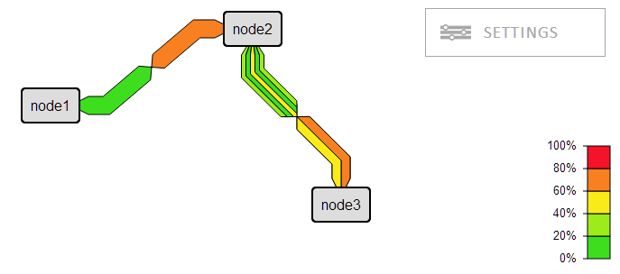

A network weathermap UI Library built with SVG.



The configuration can be done by:
* a JSON file which is load from the server
* a Javascript object
* using the API

It is possible to inject a custom UI to aid the user when creating the 
networkmap directly in the browser. Most of the configuration of the 
networkmap can be done directly in the browser and in addion the JSON
format makes it easy to parse and update the configuration.

A minimal setup is done by:

```javascript
	var map;
	window.addEvent('load', function(){
		map = new networkMap.Graph('paper').load('/spec/weathermap.json');
	});
```

```html
	<div id="paper"></div>
```

An example configuration file is found in spec/weathermap.json

## Integration
As weathermaps are usually integrated in other tools there is no backend in NetworkMap.js. 
There is however an example implementation in ```spec/update.php``` that is used in 
development to test the save functionality. Use it in production at your own risk!!!

### Populating data in the weathermap
To fetch data you need to register a datasource with ```networkMap.registerDatasource(name, function)```

The function can takes two parameters
#### url 
This is the requestUrl that is defined in the configuration.

#### requests
This is an array of objects that containing two properties (data and callback). The property data 
contains the information from requestData in the configuration and the property callback contains a 
function that should be called when the data is retreived. 

The request array structure
```javascript
[
	{
		data: {...},
		callback: function(url, request, value, realvalue)
	}
]
```

A simple dummy example of the simulations datasource that is included
```javascript
networkMap.registerDatasource('simulate', function(url, requests){
	requests.each(function(request){
		var dataPoint = Math.random();

		request.callback({
			url: url,
			request: request.data,
			value: dataPoint,
			realValue: Math.round(dataPoint * 100) + 'Mbps'
		});
	});
});
```

### Saving changes
To enable users change and create network maps there is an interface to handle this. This is done 
by ```networkMap.SettingsManager```, however the only configuration that is needed is to setup the ``onSave`` 
block in the configuration. 

#### method
This is the method the data is sent to the server.
Valid values are:
* post (default)
* get

#### url
The url to send the reqest to.

#### data
Here you are free to populate whatever information you are required to handle this on the backend.

Example configurtion:
```javascript
"onSave": {
	"method": "post",
	"url": "update.php",
	"data": {
		"id": "weathermap.json"
	}
}
```

The server should return an JSON envoded object

Status for a save that worked
```javascript
{
	"status": "ok",
	"error": null
}
```

If an error occurred
```javascript
{
	"status": "nok",
	"error": "error string"
}
```


# Build

## Set up build envionment
This installation assumes that node.js and npm is installed

* npm install

## Build from source
* grunt

## Development
* grunt watch

## Installing packages for development
This will automaticly add files to package.json
* npm install <package> --save-dev

## Adding New Javascript Files
To make the concatenation work you need to add the file to ```Gruntfile.js```

# networkMap
The only object that will polute the global object

## networkMap.datasorce
Internal object that keeps track of datasources. The project ships with one datasource `simulate` which is used for testing. To add new datasources use `networkMap.registerDatasource(name, datasouce)`

### networkMap.registerDatasource(name, datasouce) ###

#### name
The name of the datasource to register. 

#### datasource
The datasource is a function that takes to values, `url` and `requests`. Where `requests` is an object containing the `data`property` and a `callback` property. As the interface between the link renderer and datasource is not specified please see documentation for the datasource you whish to integrate against. 


## networkMap.colormap

### networkMap.registerColormap(name, colormap)

### Predefined colormaps

#### rasta5
#### flat5

## networkMap.ColorLegend
Internal object that creates and inserts the legend for colors in the graph


## networkMap.Graph

Example:
```html
	<div id="paper"></div>
```

```javascript
new networkMap.Graph('paper').load('/weathermap.json')
```

## networkMap.Node

## networkMap.Link
### redrawShadowPath()
### hideShadowPath()
### showShadowPath()
### removeShadowPath()

### redrawMainLinks()
### hideMainLinks()
### showMainLinks()
### removeMainLinks()
### mainLinksVisable()
### toggleMainLinks()

### redrawSubLinks()
### hideSubLinks()
### showSubLinks()
### removeSubLinks()
### subLinksVisable()
### toggleSubLinks()


## networkMap.path
Helperfunction, could be removed. Do not rely on this!


